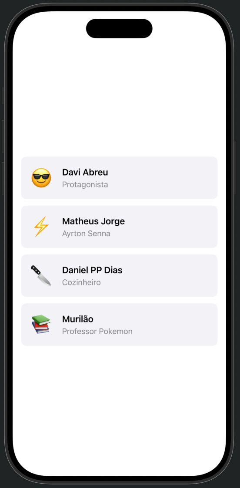
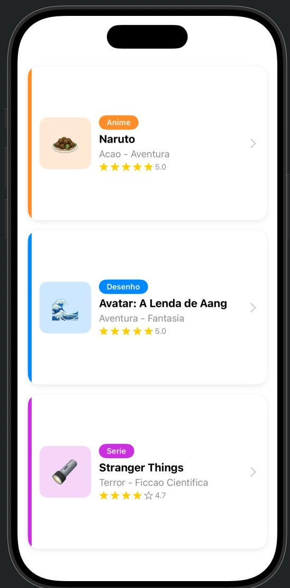
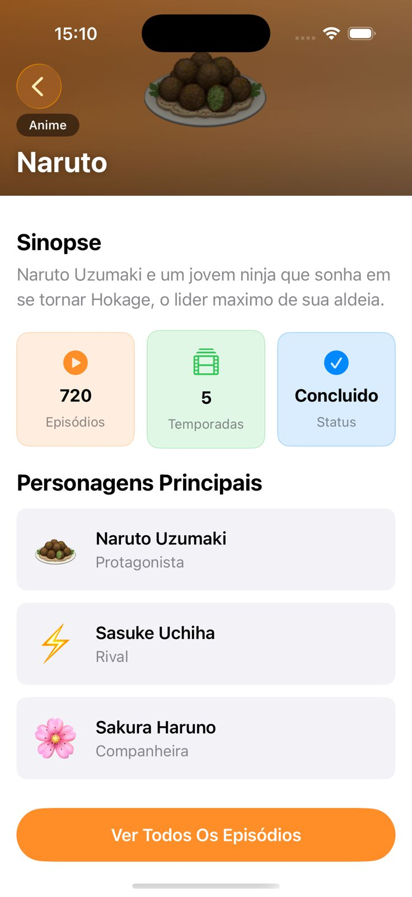
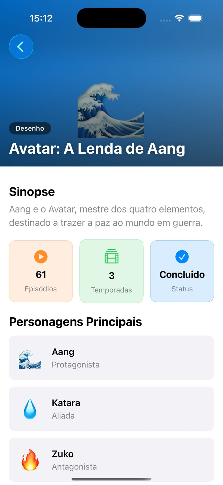
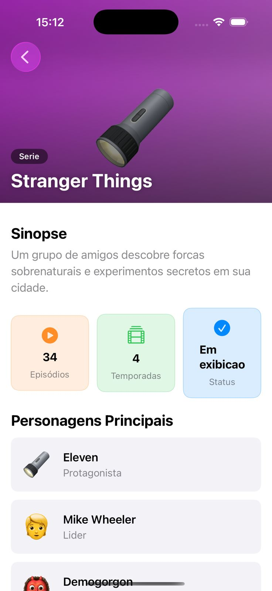

# Atividade Ponderada 2

* Davi Abreu
* Daniel Parente
* Matheus Jorge

## Relatório Ponderada

Ao ler o enunciado da atividade ponderada, entendemos que era necessário desenvolver algo como um app estilo Letterboxd, utilizando SwiftUI, listando alguns programas de TV, anime, desenhos e sendo possível abrir telas de detalhamento para cada um dos programas.

Portanto, partimos para o XCode. Aqui, o plano era estruturar a árvore de pastas conforme o que estava na docs: uma pasta `Models/`, uma pasta `Views/` e, dentro dela, uma `Components/`.

Aqui já apareceu a primeira dúvida: no Xcode, criar uma pasta não é a mesma coisa que criar um **Group** no Project Navigator. Já tinhamos chegado a criar as pastas direto no Finder, mas elas não apareciam no Xcode. Pesquisamos rapidamente, com auxílio do Claude, e rapidamente descobrimos que precisavamos usar "New Group" dentro do próprio Xcode (ou "New Group without Folder"), porque o Xcode mantém a referência das pastas em um arquivo `.xcodeproj` separado. Depois disso, organizamos:

```
ponderada2/
├── Models/
│   └── ponderada2.swift
├── Views/
│   ├── ListaView.swift
│   ├── NarutoDetailView.swift
│   ├── AvatarDetailView.swift
│   ├── StrangerDetailView.swift
│   ├── ProgramaDetailView.swift
│   └── Components/
│       ├── ShowCard.swift
│       ├── CharacterRow.swift
│       └── InfoBadge.swift
└── ContentView.swift
```



Quando copiamos os trechos de código do docs, o mesmo comportamento de ponderadas anteriores foi repetido: haviam snippets quebrados no código "base" entregado. Aqui, por exemplo, o arquivo `Models/ponderada2.swift` veio com quebras de linha estranhas e algumas chaves de fechamento ausentes, principalmente na declaração das tuplas de personagens, por exemplo:

```swift
personagens: [("Aang","Protagonista","\u{1F30A}"),
              ("Katara","Aliada","\u1F4A7"),
              ("Zuko","Antagonista","\u{1F525}")]
```

Além disso, no `ShowCard.swift` e no `NarutoDetailView.swift` faltava o `import SwiftUI` no topo, o que fazia o Xcode reclamar de "Cannot find type 'View' in scope". Arrumamos os imports em todos os arquivos de View e Component e a estrutura base ficou compilando.

Com a base ok, partimos para entender o `ContentView`. A primeira intuição foi escrever três `NavigationLink`, um para cada programa, exatamente como acabou ficando no `ListaView.swift`:

```swift
NavigationLink(destination: NarutoDetailView()) {
    ShowCard(programa: naruto)
}
.buttonStyle(PlainButtonStyle())
```

Quando rodamos, porém, mais dois problemas apareceram. O primeiro foi que o `ShowCard` inteiro estava ficando azul, com aquela cor padrão de link do iOS, e o título "Naruto" também ficava azul. Depois, cada programa tinha sua própria View de detalhe (`NarutoDetailView`, `AvatarDetailView`, `StrangerDetailView`) com praticamente o mesmo código mudando só a referência (`naruto`, `avatar`, `strangerThings`) e a cor do gradiente.

Para o problema do azul, pesquisamos "swiftui navigationlink change color" e encontramos várias respostas no Stack Overflow sugerindo `.buttonStyle(PlainButtonStyle())`. Testamos e funcionou: o card voltou a renderizar com as cores originais e o texto preto. Ao tentar entender o porquê, a explicação que fez sentido foi que o `NavigationLink` é renderizado como um botão por baixo dos panos e o estilo padrão aplica o tint do sistema (azul) em todo o conteúdo. O `PlainButtonStyle` desliga esse tint.

Para o segundo problema, da duplicação de código entre as três Detail Views, ficamos na dúvida se valia a pena refatorar ou se era melhor deixar como estava, já que funcionava. Então pensamos que a forma mais limpa era criar uma `ProgramaDetailView` que recebe um `Programa` como parâmetro:

```swift
struct ProgramaDetailView: View {
    let programa: Programa
    ...
}
```

Aí, no `ContentView`, em vez de fazer três `NavigationLink` na mão, iterar com `ForEach` sobre a lista de programas:

```swift
let programas = [naruto, avatar, strangerThings]

ForEach(programas, id: \.nome) { programa in
    NavigationLink(destination: ProgramaDetailView(programa: programa)) {
        ShowCard(programa: programa)
    }
    .buttonStyle(PlainButtonStyle())
}
```

Aqui apareceu outra dúvida: o `ForEach` exigia um `id`. A gente não tinha colocado `Identifiable` no `struct Programa` (e nem queria, porque o modelo foi "fornecido — não alterar"). Pesquisamos e descobrimos que dá pra passar um KeyPath direto com a sintaxe `id: \.nome`, usando o nome como identificador único. Como os três programas têm nomes distintos, isso resolveu sem precisar mexer no modelo.

Faltava ainda a função de mapear o tipo do programa para uma cor (laranja para Anime, azul para Desenho, roxo para Série). Colocamos isso como uma função privada dentro da própria View:

```swift
func corPorTipo(_ tipo: String) -> Color {
    switch tipo {
    case "Anime": return .orange
    case "Desenho": return .blue
    case "Serie": return .purple
    default: return .gray
    }
}
```

Chegamos até a pensar em extrair isso para uma extensão de `Color` ou para um arquivo utilitário, mas como ela só é usada em duas Views (`ShowCard` e `ProgramaDetailView`), deixamos duplicada por hora para evitar over-engineering. Se aparecesse uma terceira View precisando, a gente refatoraria.

Indo para o `ShowCard`, a parte que mais nos travou foi a exibição das estrelas de avaliação. Queriamos mostrar 5 estrelas com as primeiras N preenchidas de acordo com `programa.avaliacao` (um Double de 0.0 a 5.0). A primeira tentativa foi assim:

```swift
ForEach(0..<programa.avaliacao) { ... }
```

E o Xcode reclamou: `Cannot convert value of type 'Double' to expected argument type 'Int'`. Faz sentido (não dá pra iterar de 0 até um tipo Double). Então mudamos para iterar fixo até 5 e comparar dentro do loop:

```swift
ForEach(0..<5) { index in
    Image(systemName: index < Int(programa.avaliacao) ? "star.fill" : "star")
        .foregroundColor(index < Int(programa.avaliacao) ? .yellow : .gray)
}
```

Funcionou! Mas como a avaliação `4.7` do Stranger Things mostrava apenas 4 estrelas preenchidas (porque `Int(4.7)` arredonda para baixo). Então decidimos mostrar também o número decimal ao lado das estrelas com `String(format: "%.1f", programa.avaliacao)` (Gemini nos ajudou com essa implementação), e assim o usuário consegue ver o valor real:



Indo para a `ProgramaDetailView`, a parte do header com o emoji gigante e o gradiente colorido foi onde gastamos mais tempo. A ideia era ter um background colorido com gradiente do tipo do programa, o emoji centralizado e flutuando, e o título legível em cima. O problema é que quando o emoji ficava em cima do gradiente colorido, em algumas cores (principalmente laranja claro) o texto branco ficava ilegível.

Pesquisamos "swiftui readable text over gradient" e a sugestão que mais apareceu foi sobrepor um segundo gradiente, dessa vez transparente em cima e preto na base, para criar uma "vinheta" escura que dá contraste. Então, usando um `ZStack` com dois `LinearGradient`, ficou assim:

```swift
LinearGradient(
    colors: [corPorTipo(programa.tipo), corPorTipo(programa.tipo).opacity(0.6)],
    startPoint: .topLeading,
    endPoint: .bottomTrailing
)
.frame(height: 300)

// emoji aqui ...

LinearGradient(
    colors: [.clear, .black.opacity(0.6)],
    startPoint: .top,
    endPoint: .bottom
)
.frame(height: 300)
```

Funcionou bem, mas o header tinha uma borda branca em cima por causa da Safe Area do iPhone. Pesquiasmos e a solução foi `.ignoresSafeArea(edges: .top)` aplicado no `ScrollView`. Aí surgiu outro problema: a barra de navegação ficou desenhando por cima do título do programa. Resolvemos com `.navigationBarTitleDisplayMode(.inline)`, que deixa a navigation bar mais discreta e transparente.



Para os `InfoBadge` (Episódios, Temporadas, Status), a dúvida foi sobre como passar o ícone. Não sabiamos se precisava importar SF Symbols separadamente ou se era nativo. Vimos que basta usar `Image(systemName: "play.circle.fill")` que o iOS já resolve (consultamos o Claude para isso). Fomos no app "SF Symbols" da Apple (que precisamos baixar do site da Apple) e escolhemos os ícones `play.circle.fill`, `film.stack` e `checkmark.circle.fill`.

Por fim, o botão "Ver Todos Os Episódios". Aqui tomamos a decisão deliberada de deixar a `action` vazia, porque o escopo da atividade era a UI e não a navegação para uma tela de episódios que não existe. Colocamos um comentário mental de que, em um próximo passo, isso poderia abrir um `Sheet` ou uma nova `NavigationLink`.

Uma última dúvida nos apareceu nos `#Preview`. Quando era colocado `#Preview { ProgramaDetailView(programa: naruto) }` direto, o preview renderizava mas a barra de navegação não aparecia, e o `.navigationBarTitleDisplayMode(.inline)` não tinha efeito. Então buscamos essa informação e a resposta foi que o preview precisa estar dentro de um `NavigationStack` para simular o contexto real:

```swift
#Preview {
    NavigationStack {
        ProgramaDetailView(programa: naruto)
    }
}
```

Falando em `NavigationStack`, esse foi outro ponto. Boa parte dos tutoriais antigos usam `NavigationView`, mas o Xcode marcou como deprecated. Pesquisamos um pouco mais e vimos que a partir do iOS 16 o caminho recomendado é `NavigationStack`, então adotamos essa em todas as Views.

No fim, ficou um app com a tela inicial listando os três programas em cards, e cada card abrindo a tela de detalhes correspondente, com gradiente colorido por tipo, sinopse, badges de informação e lista de personagens. As três Views específicas (`NarutoDetailView`, `AvatarDetailView`, `StrangerDetailView`) foram mantidas no projeto apenas como referência de versionamento do primeiro approach antes da refatoração para a `ProgramaDetailView` genérica.




